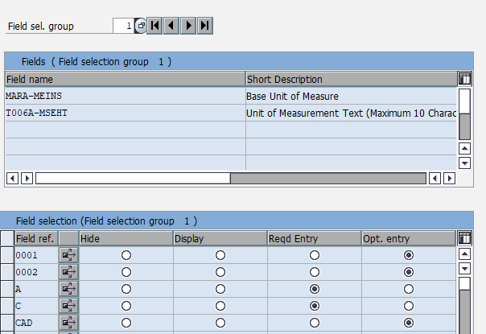

# Extended validator for Material master data
The validator allows you to define mandatory components and expected values for fields of these components.

Components are:
- Sales organisation data in table `MVKE`
- Plant data in table `MARC`
- Storage location data in table `MARD`
- Accounting data in table `MBEW`
- BOMs
- Production versions and
- Production recipes.

## Setup
Rules are defined in these customizing tables:
Table | for
----- | -----------------
`ZLINT_MAT_WPARAM` | Plant parameters
`ZLINT_MAT_MVGR` | Sales material groups
`ZLINT_MAT_VPARAM` | Accounting (Material valuation) parameters
`ZLINT_MAT_LPARAM` | Storage location parameters

## Validation
Validation takes places in two steps:
- in realtime when maintaining the material master data in transaction `MM01` or in transaction `MM02`
- in a recurring job

The first steps just validates the expected field values (class `ZCL_IM_MATERIAL_CHECKS`) for the views the user actually edits in transaction `MM01` or `MM02`. The class `ZCL_IM_MATERIAL_CHECKS` can't validate views, which the user omits or other components like production versions. The recurring job does a overall validation for all components and expected field values.
The following programs were implemented for the recurring job:
- `ZLINT_MAT_MATERIAL_COMPLETE` for validating the material with all its components
- `ZLINT_MAT_RECIPE_CHECK`for validation production recipes

## Cloning this repository
[abapGit](https://github.com/larshp/abapGit) and SAP 7.40 or higher is needed to clone this repositry.

## Out of the box validation
SAP ECC provides a out of the box validation for material master data, which is enhanced by the extended validator.
With the out of the box validation you can define mandatory fields (transaction `OMS9`) and set default values for MRP parameter in the MRP profile (transactions `MMD1`, `MMD2` and `MMD3`).
In transaction `OMS9` you edit the required or optional option for field groups and field references. Field references are assigned to material types, industry sectors or plants:

